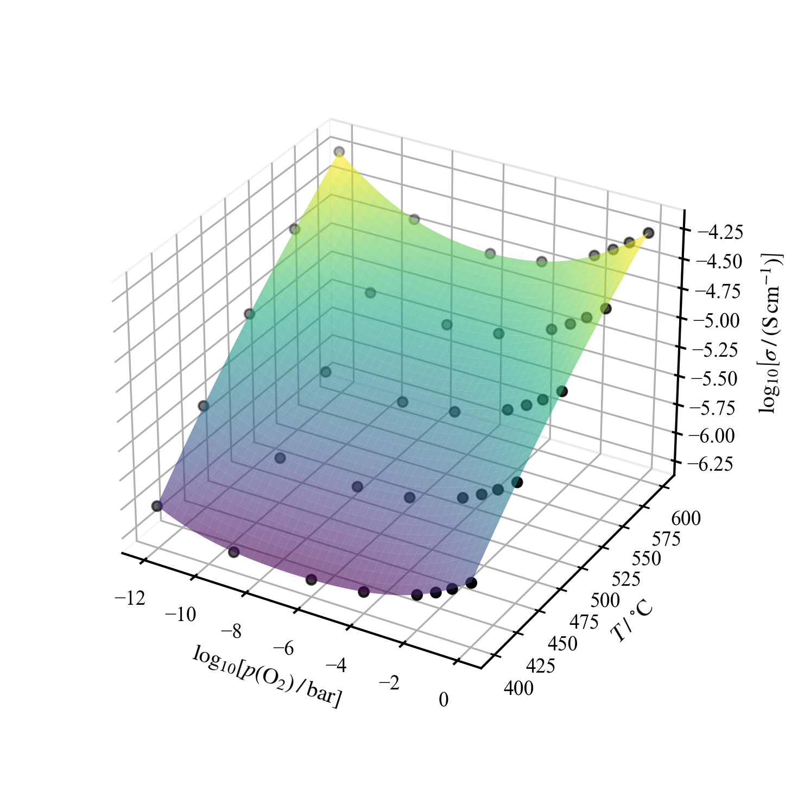

# EIS Analysis Pipeline


Python pipeline for electrochemical impedance spectroscopy of high-resistance
ceramic electrolytes and mixed conductors. It goes from raw Zahner `.ism`
files (or plain CSV spectra) to publication figures and a global conductivity
model in six sequential Jupyter notebooks, with every methodological choice
documented, tested, and reproducible.



From raw spectra to a global conductivity model. The per-stage figures that lead here are in [docs/STAGES.md](docs/STAGES.md).

| Stage | Notebook | What it does |
| ----- | -------- | ------------ |
| 0 | `stage0_oven.ipynb` | Check that furnace plateaus match the measurement schedule |
| 1 | `stage1_labeling.ipynb` | Match `.ism` files to furnace windows, label temperatures, copy valid files |
| 2 | `stage2_kk.ipynb` | Lin-KK validity test; select the best replica per (condition, T) |
| 3 | `stage3_drt.ipynb` | Tikhonov DRT, peak detection, Zarc equivalent-circuit fit |
| 4 | `stage4_plots.ipynb` | Nyquist, Bode, DRT, Arrhenius, Brouwer p(O₂) figures |
| 5 | `stage5_model.ipynb` | Global MIEC model: one six-parameter fit of σ(p(O₂), T) per process |

Stages 0 and 1 are the optional Zahner furnace-log front-end. If you bring CSV
spectra from any other instrument, you start at stage 2. Full per-stage detail
and every parameter are in [docs/STAGES.md](docs/STAGES.md).

Stage 5 fits the whole conductivity surface of each process at once. The
surface shown at the top of this page is the bundled synthetic sample: a mixed
conductor with an n-type branch at low p(O₂), an ionic plateau, and a p-type
branch at high p(O₂).

## Quickstart

```bash
git clone https://github.com/cristian-galeazzi/EIS-pipeline.git
cd EIS-pipeline
python -m venv .venv && source .venv/bin/activate
pip install -r requirements.txt
jupyter lab          # or open the folder in VS Code
```

Copy `sample_template/` to `{SAMPLE_ID}/`, drop your data into `Raw data/`
and `Raw oven/`, then run the notebooks in order. The first cell of each
notebook shows a numbered sample list, prompts for settings via `input()` and
saves them to `session.json`, so later stages pick up where the previous one
left off. Conditions and temperatures are discovered from the folder names.

**Try it without data:** the repository bundles `EXAMPLE_SAMPLE/`, a synthetic
sample (eight p(O₂) conditions from 1 bar down to 1e-12 bar, five temperatures,
two-Zarc spectra of a mixed n + ionic + p-type bulk and a pure-ionic grain
boundary, with realistic noise, regenerable with
`python tools/generate_example_sample.py`). The wide pressure span draws the
full Brouwer diagram: the p-type branch at high p(O₂), the ionic plateau, and
the n-type branch at low p(O₂). It uses the CSV entry path, so start from
`stage2_kk.ipynb`, type `EXAMPLE_SAMPLE` at the sample prompt, and continue
through stage 5. Any plausible pellet geometry works (thickness 1.4 mm,
diameter 10 mm).

Each configuration cell has a `PARAM_MODE` switch (lock, continue, reset) that
controls whether edits are saved to `session.json`; the modes and per-stage
parameters are documented in [docs/STAGES.md](docs/STAGES.md).

## Features

- Lin-KK validity test (Schönleber 2014) with adaptive frequency cuts and a
  ceramic-aware compliance score.
- Tikhonov DRT deconvolution (pyDRTtools) with peak detection and area
  integration over d(ln τ).
- Zarc equivalent-circuit fit in log space with an analytic Jacobian,
  deterministic multi-start, and `C_eff = τ/R` exactly.
- Per-isotherm ionic/electronic decomposition (NNLS) and Arrhenius energies.
- Global MIEC model: one six-parameter fit of σ(p(O₂), T) per process, solved
  by variable projection.
- Deterministic outputs, a golden-master test suite, and calibration
  procedures under [`audit/`](audit/README.md).

## Documentation

- [docs/STAGES.md](docs/STAGES.md): per-stage reference and every parameter.
- [docs/INPUT_FORMAT.md](docs/INPUT_FORMAT.md): CSV input contract and folder layout.
- [docs/MATHEMATICS.md](docs/MATHEMATICS.md): the mathematics of every engine step.
- [audit/README.md](audit/README.md): how the shipped defaults were calibrated.

## Requirements

Python ≥ 3.11 and the pinned `requirements.txt`: `zahner_analysis` (.ism
reader), `pyDRTtools` (DRT), `impedance` (circuit fit), `scipy`/`numpy`,
`pandas`/`openpyxl` (Excel I/O), `matplotlib`, `ipywidgets` (interactive
panels).

## Reproducibility and privacy

Fits are deterministic: restart guesses use a fixed per-(condition, T) seed,
and parallelism does not change the numbers. Dependencies are pinned, and
every `.xlsx` output carries a `Metadata` sheet with all parameter values and
installed library versions, so any result traces back to the configuration
that produced it. The shipped notebook defaults were each set by a documented
calibration procedure in [`audit/`](audit/README.md), not guessed.

This repository contains code only. No measurement data, fitted parameters or
sample identifiers are committed. Sample names are entered at runtime and kept
locally in `session.json` (gitignored). Raw files are never modified, and no
network calls are made. Scientific work and methodological decisions are the
author's own.

## References

- M. Schönleber, D. Klotz, E. Ivers-Tiffée, *A method for improving the robustness of linear Kramers-Kronig validity tests*, Electrochim. Acta 131 (2014) 20-27.
- T. H. Wan, M. Saccoccio, C. Chen, F. Ciucci, *Influence of the discretization methods on the distribution of relaxation times deconvolution*, Electrochim. Acta 184 (2015) 483-499.
- M. D. Murbach et al., *impedance.py: A Python package for electrochemical impedance analysis*, J. Open Source Softw. 5(52) (2020) 2349.

The full reference list is in [docs/STAGES.md](docs/STAGES.md).

## AI assistance

This software was developed with the assistance of Claude (Anthropic): the
initial version with Claude Fable, later revisions with Claude Opus. Every
change was supervised and reviewed by the author, who remains solely
responsible for the method, the validation suite and any result published
using this software.

## License

MIT, see [LICENSE](LICENSE).

## How to cite

Citation metadata are in [CITATION.cff](CITATION.cff); GitHub shows a "Cite
this repository" button generated from it. A Zenodo DOI will be added with the
first public release.
