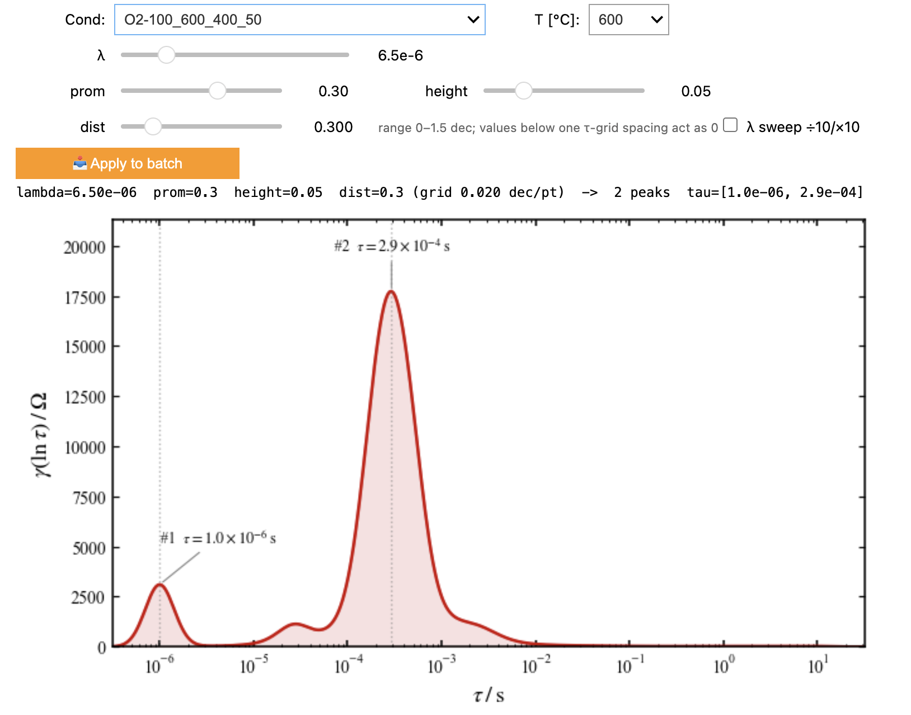
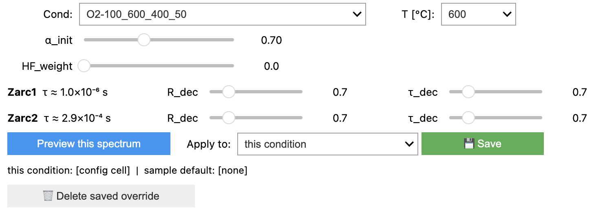
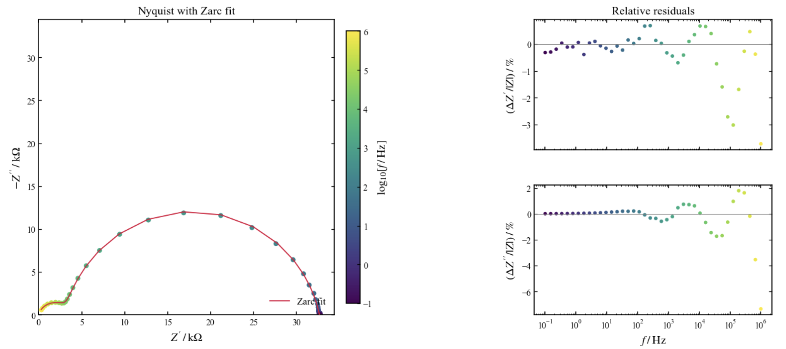
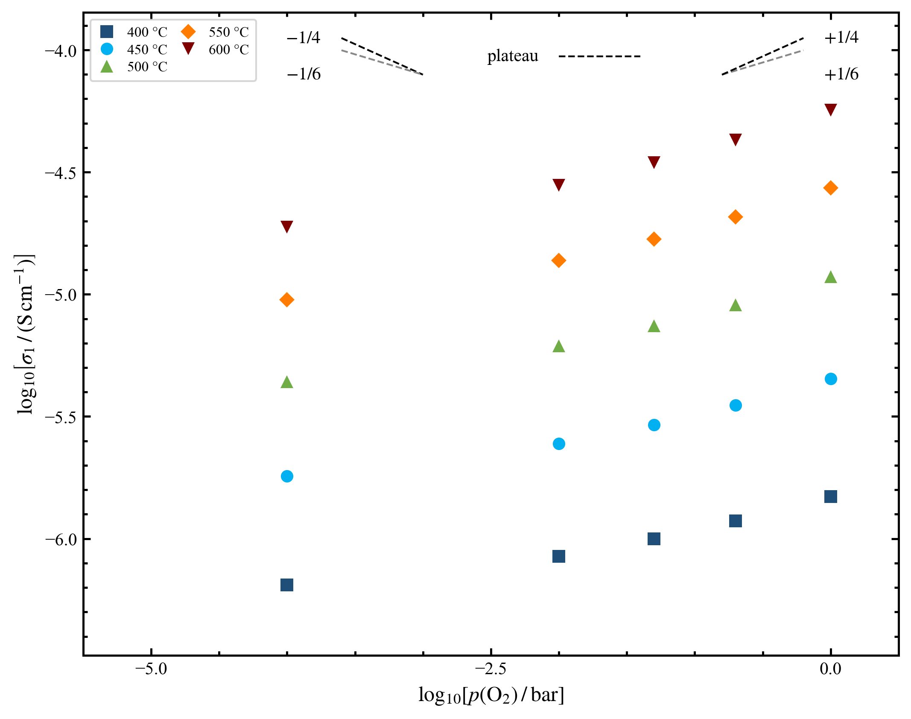

# Pipeline stages

Full detail for each stage, including every configuration parameter. The
[README](../README.md) has the quick tour; this file is the reference. The
mathematics behind each engine step is in [MATHEMATICS.md](MATHEMATICS.md).

Most users enter through the CSV path at Stage 2 (see
[INPUT_FORMAT.md](INPUT_FORMAT.md)). Stages 0 and 1 are the optional Zahner
furnace-log front-end.

---

## Configuration modes (`PARAM_MODE`)

Every configuration cell has a `PARAM_MODE` switch that acts as write
protection for the whole notebook, covering both the scalar parameters and the
per-spectrum decisions (frequency cuts in `kk_overrides`, manual replica
`overrides`, per-condition fit tweaks in `condition_params` and the Zarc peak
stores). Hand-edit the string at the top of the configuration cell and re-run
it to switch.

- `PARAM_MODE = "lock"` is reproduction mode. Everything loads from
  `session.json` and nothing in the notebook writes back: widgets and Apply
  buttons are view-only, so re-running the notebook always reproduces the
  saved analysis. Use it once a sample is calibrated, or to hand the analysis
  to someone else.
- `PARAM_MODE = "continue"` is build mode. The configuration cell is the
  base: starting values load from `session.json` when present, and every
  edit, whether in the cell, a widget or an Apply button, is saved to
  `session.json` as a merge that touches only the values you changed. Use
  this to keep tuning a calibration across sessions.
- `PARAM_MODE = "reset"` deliberately ignores `session.json`: starting values
  come from the notebook's own literals, and the next save overwrites the
  saved history on purpose. Use only when you want to start that stage's
  scalar tuning over; per-condition/per-spectrum overrides are untouched by
  reset (see each notebook's Configuration cell for the exact scope).

A colored banner under each configuration cell states which mode is active
(green for lock, amber for continue, red for reset). The parameter priority
in continue/reset mode is: configuration cell first, then any
per-(condition, temperature) override you apply from a tuning panel.

All notebooks support temperature-by-temperature processing via `FOCUS_T`;
export cells are merge-aware, so rows for other temperatures are preserved
when you process one at a time.

---

## Stage 0 and Stage 1: from furnace log to labeled spectra

**Code:** `pipeline/matching.py::match_ism_to_furnace`, `pipeline/matching.py::build_auto_labels`, `pipeline/ingest.py::scan_condition_dir`

Stages 0 and 1 are optional: they are the Zahner furnace-log front-end, so
use them only if you measure with a Zahner instrument and record a furnace
log. CSV users skip straight to stage 2.

Stage 0 parses the furnace logs and plots temperature against time with
plateau annotations, so schedule mistakes are caught before any analysis.
Stage 1 matches each `.ism` file to its furnace window, verifies the
temperature was stable while the spectrum was measured, assigns the
temperature label and copies valid files to `ISM validation/`. Gas-flow
numbers in folder names are valve setpoints; the actual $`p_{\text{O}_2}`$ is
always read from the lambda-probe signal in the furnace log.

| Parameter | Default | Purpose |
| --------- | ------- | ------- |
| `TABLE_INTERVAL_S` | 300 s | Stage-0 plateau table sampling interval |
| `T_STABILITY_STD` | 1 °C | Maximum temperature standard deviation during measurement |
| `T_PRE_MARGIN_MIN` | 25 min | Stability window before measurement start |
| `T_POST_MARGIN_MIN` | 5 min | Stability window after measurement end |
| `T_ROUND_STEP` | 25 °C | Temperature rounding step |
| `T_PLATEAU_RANGE` | (395, 605) | Valid plateau range [°C]; widen for other ranges |

Status codes: `VALID`, `UNSTABLE`, `NEAR_TRANSITION`, `OUT_OF_RANGE`,
`OUTSIDE_RANGE`. The matching cell prints one summary row per condition and
expands to per-file tables when a mismatch is detected (or with
`SHOW_DETAILS = True`).

---

## Stage 2: Lin-KK validity test

**Code:** `pipeline/quality.py::run_linkk`, `pipeline/quality.py::select_best_replica`, `pipeline/quality.py::compute_frequency_cutoffs`

<!-- img-slot: img/stage2_kk_panel.png -->

A spectrum is worth fitting only if it describes a causal, linear,
time-invariant system. The Lin-KK test (Schönleber et al. 2014) checks this
by fitting the spectrum with a chain of $`M`$ RC elements whose time constants
are fixed log-spaced across the measured range, leaving only the weights
free; the chain is written out in [MATHEMATICS.md](MATHEMATICS.md) section 1.

That chain is Kramers-Kronig consistent by construction, so any systematic
misfit flags a KK violation (drift, nonlinearity, artifacts). Compliance is
judged on the magnitude-normalized residuals: a compliant spectrum leaves
only noise in $`r_\text{re}`$ and $`r_\text{im}`$, so each residual vector is
tested for normality with the Shapiro-Wilk statistic ($`W`$ approaches 1 for
structure-free residuals) and `kk_score = (W_re + W_im) / 2`. Classification:
GREEN (`kk_score` at least 0.97), YELLOW (at least 0.90), RED (excluded
downstream). A ceramic-aware dual criterion (`KK_USE_W_CRITERIA = True`) is
looser on $`Z''`$, which is intrinsically noisier in high-impedance ceramics;
enable it only when the strict score rejects spectra that look valid by eye.

Two $`M`$-selection modes exist (`KK_USE_BINARY_M`):

- **Automatic** (`True`): smallest $`M`$ whose residual sign-change fraction
  $`\mu`$ reaches `KK_MU_TARGET` (under-fitting leaves correlated residuals
  with $`\mu`$ well below 0.5, over-fitting chases noise with $`\mu`$
  approaching 1).
  $`M`$ is scanned linearly because $`\mu(M)`$ is not monotonic. If no $`M`$
  reaches the target, the count falls back to the Percentage-mode one at the
  same density.
- **Percentage** (default): $`M = \text{round}(cN)`$ with the density $`c`$
  (`KK_C`). The shipped density, 0.76, is calibrated on the author's dataset (see
  `audit/kk_mode_comparison.py` to recalibrate on yours); the RelaxIS KK-View
  default is 0.50.

Edge frequencies whose residuals sit outside an adaptive IQR fence are cut,
and the surviving `f_min`/`f_max` window is stored per (condition, T) and
applied by every later stage. $`\mu`$ is only used to select $`M`$; spectrum
quality is always judged by the $`W`$ statistics.

| Parameter | Default | Purpose |
| --------- | ------- | ------- |
| `KK_C` | 0.76 | RC-element density $`c`$ in $`M = \text{round}(cN)`$ |
| `KK_MU_TARGET` | 0.50 | Sign-change target $`\mu`$ in automatic mode |
| `KK_F_MIN_HARD` | None | Hard lower frequency cutoff (None = adaptive only) |
| `KK_F_MAX_HARD` | None | Hard upper frequency cutoff (None = off) |
| `KK_IQR_FENCE` | 2.0 | IQR fence for the adaptive residual cut |
| `KK_IQR_WINDOW` | 5 | Consecutive clean points anchoring the cut |
| `KK_USE_W_CRITERIA` | False | Ceramic dual criterion |
| `KK_OVERRIDES`, `OVERRIDES` | `{}` | Per-(condition, T) frequency and replica overrides |

---

## Stage 3: DRT deconvolution and Zarc fit

**Code:** `pipeline/drt.py::compute_drt`, `pipeline/drt.py::find_drt_peaks`, `pipeline/fitting.py::fit_zarc`, `pipeline/fitting.py::fit_condition_batch`

The distribution of relaxation times decomposes the impedance response into a
continuous superposition of ideal RC relaxations and recovers the
distribution $`\gamma`$ by Tikhonov regularization with a second-order
derivative operator (pyDRTtools, Wan et al. 2015). The transform, the penalty
and the peak-area integral are written out in
[MATHEMATICS.md](MATHEMATICS.md) section 2. Each peak of $`\gamma`$ is one
relaxation process; its area over $`d(\ln\tau)`$ estimates the process
resistance and seeds the circuit fit. The integration variable is $`\ln\tau`$
and not $`\log_{10}\tau`$, which would underestimate the areas by a factor
$`\ln 10 \approx 2.303`$.

The detected peaks then seed a non-linear least-squares fit to a series-Zarc
circuit ([MATHEMATICS.md](MATHEMATICS.md) section 3.1), in which $`R_i`$ is the
arc resistance (the diameter of the $`i`$-th depressed semicircle, i.e. the DC
resistance of process $`i`$), $`\tau_i`$ its relaxation time and
$`\alpha_i \in (0, 1]`$ the CPE exponent. $`R`$ and $`\tau`$ are bounded to
`ZARC_R_DEC` / `ZARC_TAU_DEC` decades around their DRT seeds; the optimizer
works in log space ($`\ln R`$, $`\ln\tau`$, $`\alpha`$) with an analytic Jacobian
and bounded trust-region least squares, which conditions the decades-spanning
valley properly (the engine-migration validation record lives in
`audit/fitting_v2/`). Fits run with deterministic multi-start
(`ZARC_N_RESTARTS`, fixed per-(condition, T) seed) and a warm-start chain
down the temperature ladder. Independent conditions are fitted in parallel
processes; the warm-start chain stays sequential within a condition, so
parallelism does not change the numbers.

For the Zarc parametrization the effective capacitance is exactly
$`C_\text{eff} = \tau/R`$, an identity that holds for any $`\alpha`$
([MATHEMATICS.md](MATHEMATICS.md) section 3.2). The pellet geometry turns
each arc resistance into a conductivity and each effective capacitance into a
relative permittivity (section 3.7).

| Parameter | Default | Purpose |
| --------- | ------- | ------- |
| `L_m`, `D_m` | required | Pellet thickness and diameter [m] |
| `DRT_CV_TYPE` | custom | $`\lambda`$ selection: `custom` or cross-validation |
| `DRT_RBF_DER` | 2nd order | RBF derivative order (RelaxIS: Derivative) |
| `DRT_SHAPE_S` | 0.5 | RBF shape factor $`S`$ |
| `DRT_LAMBDA` | 6.5e-6 | Regularization parameter $`\lambda`$ (custom mode) |
| `PEAK_HEIGHT_FRAC` | 0.05 | Height floor as a fraction of $`\gamma_\text{max}`$ |
| `PEAK_MIN_DIST_DECADES` | 0.3 | Minimum peak separation in $`\log\tau`$ |
| `PEAK_MIN_PROM_DECADES` | 0.3 | Log-prominence threshold (0 = off) |
| `N_PEAKS_CAP` | 4 | Keep at most this many peaks (largest $`R`$ first) |
| `N_PEAKS_OVERRIDE` | `{}` | Force a peak count for specific (condition, T) |
| `ZARC_INCLUDE_R0` | False | Include the series resistance $`R_0`$ in the circuit |
| `ZARC_R0_MAX` | 200 Ω | Upper bound on $`R_0`$ |
| `ZARC_R_DEC`, `ZARC_TAU_DEC` | 0.70 | Search window around DRT seeds [decades] |
| `ZARC_ALPHA_INIT` | 0.70 | Initial $`\alpha`$ per Zarc |
| `ZARC_HF_WEIGHT` | 0 | Extra high-frequency weighting (0 = off) |
| `ZARC_FIX_PARAMS` | `{}` | Pin individual $`R`$, $`\tau`$, $`\alpha`$ values per (condition, T) |
| `ZARC_N_RESTARTS` | 4 | Random restarts until `ZARC_RMSE_TOL` (0.02) |
| `ZARC_N_JOBS` | 0 | Parallel fit processes (0 = one per core) |

The live panel sizes the $`R`$/$`\tau`$ search windows **per Zarc element**: one
slider pair per detected DRT peak, built automatically for any peak count
and keyed by `peak_id`, so a window follows its process when the number of
peaks changes along the temperature series. A window states how much you
trust that peak's DRT seed, so it is legitimately peak-dependent: size only
the window of the process the bound check flags as pinned. **Re-fit** is a
pure preview (it replicates the batch warm-start chain, saves nothing);
**Apply: this condition** persists the windows plus $`\alpha`$/HF for every
temperature of the condition; **Apply: all conditions** persists them as
the sample-wide default. Windows are deliberately never varied
temperature-by-temperature: that would sculpt the very Arrhenius trends the
fit measures. Everything persists in `session.json` (`zarc_peak_windows`,
`condition_params`; legacy `zarc_peak_bounds` entries from older versions
are honored until an Apply replaces them) and is re-applied by the batch
fit, so a fresh kernel reproduces the exported sheets exactly.

**Process identification** is never automatic. Use the $`C_\text{eff}`$
magnitude plot and the Arrhenius behavior; the thresholds below are the
literature starting points of Vendrell & West 2018 for YSZ, not a
classification the pipeline applies:

| $`C_\text{eff}`$ | Typical process |
| -------------- | --------------- |
| $`< 10^{-11}`$ F | bulk |
| $`10^{-11}`$ to $`10^{-8}`$ F | grain boundary |
| $`10^{-8}`$ to $`10^{-6}`$ F | near-electrode |
| $`> 10^{-6}`$ F | electrode |

---

## Stage 4: figures and per-isotherm analysis

**Code:** `pipeline/plots.py::build_arrhenius_results`, `pipeline/plots.py::fit_transference`

<!-- img-slot: img/stage4_nyquist.png -->

Stage 4 reads the stage-3 outputs and generates publication figures (PNG and PDF):
per condition the DRT stack, Nyquist, Bode and a two-by-two Arrhenius panel;
across conditions the Brouwer $`p_{\text{O}_2}`$ diagram and its
ionic/electronic decomposition. Nyquist and Bode figures keep only physically
valid points (rows with $`Z' < 0`$ or $`Z'' < 0`$ are high-frequency instrument
artifacts; no passive circuit can produce them).

| Parameter | Default | Purpose |
| --------- | ------- | ------- |
| `DRT_TAU_MAX` | 0.1 s | x-axis upper limit on the DRT stacked plot |
| `BROUWER_PEAK_ID` | 1 | Peak index for the Brouwer diagram |
| `BROUWER_TEMPS` | None | Temperatures shown in Brouwer (None = all) |
| `ARRHENIUS_T_MIN` | None | Exclude temperatures below this [°C] from Arrhenius fits |
| `ARRHENIUS_SUM_PEAKS` | None | Peaks summed into the HF-block $`\sigma`$ Arrhenius |
| `TRANSF_EXPONENT` | 0.25 | Brouwer exponent $`x`$ used by the per-isotherm decomposition |
| `TRANSF_PEAK_IDS` | None | Peaks shown in transference figures (None = all) |
| `PLOT_WINDOWS` | `{}` | Per-condition axis crop, kept in `session.json` |

### Arrhenius analysis

Each Zarc peak gets two independent fits, one on the conductivity and one on
the relaxation time, both written out in [MATHEMATICS.md](MATHEMATICS.md)
section 4. The conductivity line has a negative slope, the relaxation line a
positive one.

A third fit on $`\ln C_\text{eff}`$ must satisfy
$`E_\text{a}^\text{C} = E_\text{a}^\text{pol} - E_\text{a}^\text{cond}`$, since
$`\ln C = \ln\tau - \ln R`$: an internal consistency check, not a new
measurement. Energies are reported in eV.

### Ionic/electronic decomposition (per isotherm)

The conductivity of a mixed conductor is the sum of three parallel channels:
ionic (oxygen vacancies, $`p_{\text{O}_2}`$-independent), p-type (holes or
small polarons, increasing with $`p_{\text{O}_2}`$) and n-type (reduction
electrons, increasing as $`p_{\text{O}_2}`$ falls). In the dilute defect regime
mass action fixes the slopes, so at each temperature the conductivity is
**linear** in the three unknown partial conductivities, with the Brouwer
exponent $`x`$ set by `TRANSF_EXPONENT` ([MATHEMATICS.md](MATHEMATICS.md)
section 5).

The fit is a single linear least-squares solve under the physical constraint
that no partial conductivity is negative, which is exactly the NNLS
algorithm. The constraint matters: where a channel is genuinely absent, NNLS
returns exactly zero instead of a small negative value chasing noise, so a
zero means "not present in the data", not a measured value. Each isotherm is
solved independently and needs at least four $`p_{\text{O}_2}`$ points; the
local Brouwer slope equals $`x\,(t_{p\text{-type}} - t_{n\text{-type}})`$, and
the ionic transference number
$`t_\text{ion} = \sigma_\text{ion}/\sigma_\text{tot}`$ is tabulated per peak in
`Results/pO2/stage4_transference.xlsx`.

A second fit, $`\ln(\sigma T)`$ against $`1/T`$ on the per-isotherm
$`\sigma_\text{ion}(T)`$ and $`\sigma_{p\text{-type}}(T)`$, gives each channel
its activation energy. Two straight lines with distinct $`E_\text{a}`$ are the
rigorous proof that the decomposition separated two physically different
channels. Temperatures where NNLS returned zero carry no information about
that channel and are skipped, so the point count can differ between
$`\sigma_\text{ion}`$ and $`\sigma_{p\text{-type}}`$ for the same peak.
Transference figures are drawn only for transport processes
(`TRANSF_PEAK_IDS`): $`t_\text{ion}`$ is meaningful for bulk and grain
boundary, not for electrode arcs whose $`p_{\text{O}_2}`$ dependence comes from
oxygen-exchange kinetics at the interface.

### HF-block sum (`ARRHENIUS_SUM_PEAKS`)

Below some temperature two close peaks may no longer separate reliably.
Their series resistances still add, so $`\sigma = L/[(R_1 + R_2)A]`$ stays well
defined at every $`T`$. The `Arrhenius_sigma_HF_*` figure draws the separated
branches only for $`T \geq`$ `ARRHENIUS_T_MIN` and the series sum over the full
range. The sum mixes processes with different $`E_\text{a}`$, so its line may
curve slightly and its $`E_\text{a}`$ is an effective value for the block.

---

## Stage 5: global MIEC model

**Code:** `pipeline/model.py::fit_global_conductivity`, `pipeline/model.py::stoichiometric_pO2`, `pipeline/model.py::global_transference_table`

The stage-4 decomposition treats each isotherm in isolation and drops
temperatures with too few $`p_{\text{O}_2}`$ points. Stage 5 removes both
limitations by fitting the whole conductivity surface of each process at
once: one prefactor and one activation energy per conduction channel, with
the Brouwer exponent fixed by `MODEL_EXPONENT`. The model is written out in
[MATHEMATICS.md](MATHEMATICS.md) section 6.1.

Those parameters are material constants over the whole
($`p_{\text{O}_2}`$, $`T`$) surface; that constancy is itself the validity test.
The fit is solved by variable projection: at fixed activation energies the
model is linear in the prefactors (exact NNLS, inner problem), so only the
activation energies are optimized non-linearly (outer problem), and a final
polish over every parameter yields the uncertainties. Section 6.2 gives the
design matrix. Validation: the global $`R^2`$, a structureless residual map
over ($`p_{\text{O}_2}`$, $`T`$), and the predicted electronic conductivity
minimum, which follows in closed form ([MATHEMATICS.md](MATHEMATICS.md)
section 6.4) and whose migration with $`T`$, its slope set by the difference of
the two electronic activation energies, is an independent check against the
data.

| Parameter | Default | Purpose |
| --------- | ------- | ------- |
| `MODEL_PEAK_IDS` | `[]` | Peaks to fit (`[]` = all) |
| `MODEL_EXPONENT` | 0.25 | Brouwer exponent $`x`$ used by the global model |
| `MODEL_CONDITIONS` | `[]` | Conditions (pressures) to include (`[]` = all) |
| `MODEL_T_MIN`, `MODEL_T_MAX` | None | Temperature window for the fit [°C] |
| `MODEL_CHANNELS` | `["ion","p","n"]` | Channels of the model to fit (subset) |

Which channels exist (`MODEL_CHANNELS`) is an operator decision based on
defect-chemistry reasoning, not a fit outcome: drop `n` when the measured
$`p_{\text{O}_2}`$ window is never reducing enough to create electrons. The fit
never adds or removes channels on its own; an excluded channel is stored with
$`\sigma_0 = 0`$ and $`E_\text{a}`$ = NaN (all nine parameter columns are kept
for schema stability) and appears in no figure. A selected channel that NNLS
drives to $`\sigma_0 = 0`$ is reported as `not active (s0 = 0)` instead of a
meaningless activation energy, and the conductivity-minimum prediction is
reported only when both electronic channels are present. Outputs:
`Results/pO2/stage5_model.xlsx`, the `Stage5_*` figures, and the
`stage5_params` key of `session.json`.

---

## References

**Lin-KK**

- M. Schönleber, D. Klotz, E. Ivers-Tiffée, *A method for improving the robustness of linear Kramers-Kronig validity tests*, Electrochim. Acta 131 (2014) 20-27.
- B. A. Boukamp, *A linear Kronig-Kramers transform test for immittance data validation*, J. Electrochem. Soc. 142 (1995) 1885-1894.

**DRT**

- T. H. Wan, M. Saccoccio, C. Chen, F. Ciucci, *Influence of the discretization methods on the distribution of relaxation times deconvolution: implementing radial basis functions with DRTtools*, Electrochim. Acta 184 (2015) 483-499.
- A. Maradesa, B. Py, T. H. Wan, M. B. Effat, F. Ciucci, *Selecting the regularization parameter in the distribution of relaxation times*, J. Electrochem. Soc. 170 (2023) 030502. (Cited for the automatic $`\lambda`$-selection methods exposed by `DRT_CV_TYPE`; the validated default uses a fixed $`\lambda`$.)

**Equivalent circuits**

- J. T. S. Irvine, D. C. Sinclair, A. R. West, *Electroceramics: characterization by impedance spectroscopy*, Adv. Mater. 2 (1990) 132-138.
- X. Vendrell, A. R. West, *Electrical properties of yttria-stabilized zirconia, YSZ single crystal: local AC and long range DC conduction*, J. Electrochem. Soc. 165 (2018) F966-F975.

**Software used by the engine**

- M. D. Murbach, B. Gerwe, N. Dawson-Elli, L.-k. Tsui, *impedance.py: A Python package for electrochemical impedance analysis*, J. Open Source Softw. 5(52) (2020) 2349.
- pyDRTtools (Ciucci group), https://github.com/ciuccislab/pyDRTtools - implementation of the DRT method of Wan et al. (2015).

**Scientific computing**

- G. Wilson et al., *Best Practices for Scientific Computing*, PLoS Biology 12(1) (2014) e1001745.
- G. Wilson et al., *Good Enough Practices in Scientific Computing*, PLoS Computational Biology 13(6) (2017) e1005510.
- A. Scopatz, K. D. Huff, *Effective Computation in Physics*, O'Reilly Media (2015).
